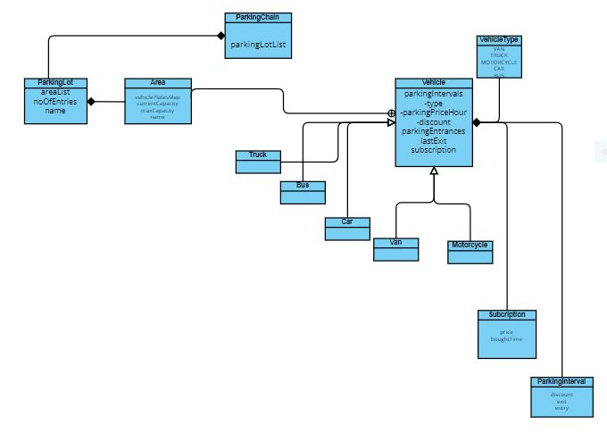

# Parking Manager System

## Description
The **Parking Manager System** is an application designed to manage a network of paid parking lots and track customers for statistical purposes. Parking lots contain relevant information such as the parking code and the number of available spots. Upon entry to a paid parking lot, details are collected, including the chosen parking lot, vehicle number, type, entry date and time, and duration. Customers can also create accounts for tracking their usage.

## Objectives
- **Objective 1**: Develop a parking configuration interface that allows administrators to input details like location, capacity, and other relevant information into a centralized system.
    - **Sub-Objective 1.1**: Create an admin interface for entering parking lot data.
    - **Sub-Objective 1.2**: Implement functionality to add, modify, and remove parking lots from the network.
- **Objective 2**: Implement a feature to track frequent parking lot usage.
    - **Sub-Objective 2.1**: Develop a database to record the parking history of customers.
    - **Sub-Objective 2.2**: Create a user interface for registering usage data.
- **Objective 3**: Provide parking managers with detailed insights into overall revenue and parking occupancy rates for a given day.
    - **Sub-Objective 3.1**: Collect and record data on the number of cars and associated revenue.
    - **Sub-Objective 3.2**: Create a manager interface to view parking details.

## Architecture

## Features/Usage Examples
- Configure a parking lot and add it to a network of parking lots.
- Retrieve information about a parking lot, including the current occupancy rate.
- Display details about daily parking revenue or the number of cars with subscriptions using the parking lot.
- Persistent data storage ensures no information is lost.

